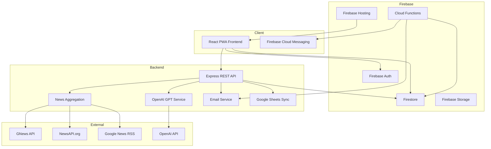

# Nexora Architecture

## System Overview



## Data Flow — News Pipeline

```
Search Query / User Interests
        ↓
  Fetch from Providers (parallel)
  ├── Google News RSS
  ├── GNews API
  └── NewsAPI
        ↓
  Deduplicate Articles
        ↓
  Rank by Personalization Score
  ├── Interests (40%)
  ├── Profession (20%)
  ├── Age (10%)
  ├── Country (10%)
  ├── Reading History (5%)
  └── Trending Topics (5%)
        ↓
  OpenAI GPT Summarization
        ↓
  Deliver to User (Feed / Search / Digest)
```

## Firestore Collections

| Collection | Purpose |
|-----------|---------|
| `users` | User profiles and preferences |
| `bookmarks` | Saved articles |
| `preferences` | Theme, language, notification settings |
| `readingHistory` | Article read tracking |
| `searchHistory` | Search query log |
| `dailyDigest` | Generated daily digests |
| `notifications` | In-app notifications |
| `adminLogs` | Admin action audit trail |
| `analytics` | Daily analytics snapshots |

## Folder Structure

```
packages/
├── shared/src/
│   ├── types.ts          # Shared TypeScript interfaces
│   ├── constants.ts      # Greeting, interests, utilities
│   └── index.ts
├── backend/src/
│   ├── config/           # Environment configuration
│   ├── middleware/       # Auth, rate limiting
│   ├── routes/           # REST API routes
│   ├── services/         # Business logic
│   └── index.ts
└── frontend/src/
    ├── components/
    │   ├── ui/           # ShadCN UI components
    │   ├── auth/         # Login animations
    │   ├── news/         # News cards
    │   └── ai/           # AI assistant
    ├── contexts/         # Auth, theme providers
    ├── lib/              # Firebase, API, i18n, utils
    ├── pages/            # Route pages
    └── App.tsx
functions/src/
└── index.ts              # Daily digest, user creation, analytics
```
