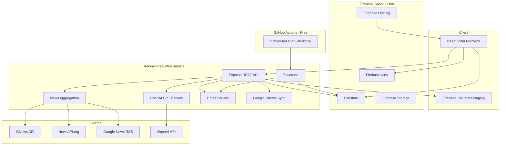

# Nexora Architecture

## System Overview (Free Tier)



## Backend Structure

```
packages/backend/src/
├── routes/           # Express routers
│   ├── user.routes   # Profile, onboarding, bootstrap
│   ├── cron.routes   # Scheduled job triggers (CRON_SECRET)
│   └── ...
├── controllers/      # Request handlers
├── services/         # Business logic
│   ├── cron.service  # Digest, analytics, trending, cache, health
│   ├── ai.service
│   ├── news.service
│   └── email.service
├── repositories/     # Firestore data access
└── middleware/       # Auth, rate limit, cron secret
```

## Scheduled Jobs

All former Cloud Functions are HTTP cron endpoints on the Express API, triggered by `.github/workflows/cron.yml`:

| Endpoint | Schedule | Purpose |
|----------|----------|---------|
| `POST /api/cron/daily-digest` | Hourly | Send 9 AM local digests |
| `POST /api/cron/sync-analytics` | Daily midnight UTC | Write analytics snapshot |
| `POST /api/cron/refresh-trending` | Every 6 hours | Update TrendingTopics |
| `POST /api/cron/cleanup-cache` | Daily 2 AM UTC | Purge expired NewsCache |
| `POST /api/cron/record-health` | Every 15 minutes | Log SystemHealth |

## User Registration

1. Frontend creates Firebase Auth user
2. Frontend calls `POST /api/users/bootstrap` (replaces Auth trigger)
3. Backend creates Firestore `users/{uid}` with admin role if email matches `ADMIN_EMAIL`
4. User completes onboarding via `POST /api/users/onboarding`

## Deployment

| Component | Platform |
|-----------|----------|
| Frontend | Firebase Hosting (Spark) |
| API | Render Free Web Service |
| Cron | GitHub Actions |
| Database | Firestore (Spark) |

See [DEPLOYMENT.md](../DEPLOYMENT.md) for setup instructions.
